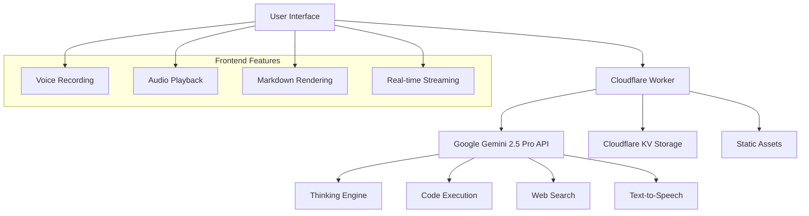

# 🤖 Gemini Chat Agent

[](https://opensource.org/licenses/MIT)
[](https://www.typescriptlang.org/)
[](https://workers.cloudflare.com/)
[](https://ai.google.dev/)

An advanced AI chat agent powered by **Google Gemini 2.5 Pro** with sophisticated capabilities including deep thinking, code execution, real-time web search, voice interaction, and text-to-speech. Built on Cloudflare Workers for global edge deployment.

## ✨ Features

### 🧠 **Advanced AI Capabilities**
- **Deep Thinking**: Transparent reasoning process with collapsible thinking sections
- **Code Execution**: Real-time Python code execution with live results
- **Web Search**: Real-time Google Search integration for current information
- **Multi-modal**: Support for text, voice, and audio interactions

### 🎤 **Voice Integration**
- **Voice Recording**: Hold-to-record voice messages with automatic transcription
- **Text-to-Speech**: High-quality speech synthesis with multiple voice options
- **Audio Processing**: Advanced audio handling with Web Audio API

### 💬 **Chat Experience**
- **Real-time Streaming**: Live response streaming with Server-Sent Events
- **Chat History**: Persistent conversation history with Cloudflare KV storage
- **Markdown Support**: Rich text formatting with syntax highlighting
- **Session Management**: Automatic session handling and restoration

### 🚀 **Performance & Deployment**
- **Edge Computing**: Deployed on Cloudflare Workers for global low-latency
- **Scalable Architecture**: Serverless design with automatic scaling
- **Static Assets**: Optimized asset delivery through Cloudflare CDN

## 🏗️ Architecture



### Data Flow
1. **User Input**: Text or voice message captured in the frontend
2. **Processing**: Cloudflare Worker processes the request
3. **AI Integration**: Gemini API handles thinking, search, and code execution
4. **Streaming Response**: Real-time response streaming to the frontend
5. **Storage**: Chat history persisted in Cloudflare KV
6. **Audio**: Optional TTS generation and playback

## 🚀 Quick Start

### Prerequisites
- Node.js 18+ and npm
- Cloudflare account
- Google AI Studio API key

### 1. Clone and Install
```bash
git clone https://github.com/objones25/gemini-chat-agent.git
cd gemini-chat-agent
npm install
```

### 2. Configure Environment
```bash
# Create environment file
echo "GEMINI_API_KEY=your_gemini_api_key_here" > .dev.vars
```

### 3. Run Locally
```bash
npm run dev
```

Visit `http://localhost:8787` to start chatting!

## ⚙️ Installation & Setup

### Environment Variables

Create a `.dev.vars` file in the project root:

```env
# Required: Google AI Studio API Key
GEMINI_API_KEY=your_gemini_api_key_here
```

### Cloudflare Setup

1. **Install Wrangler CLI**:
   ```bash
   npm install -g wrangler
   ```

2. **Login to Cloudflare**:
   ```bash
   wrangler login
   ```

3. **Create KV Namespace**:
   ```bash
   wrangler kv:namespace create "CHAT_HISTORY"
   wrangler kv:namespace create "CHAT_HISTORY" --preview
   ```

4. **Update wrangler.toml** with your KV namespace IDs:
   ```toml
   [[kv_namespaces]]
   binding = "CHAT_HISTORY"
   id = "your_production_namespace_id"
   preview_id = "your_preview_namespace_id"
   ```

### Google AI Studio Setup

1. Visit [Google AI Studio](https://aistudio.google.com/)
2. Create a new API key
3. Add the API key to your `.dev.vars` file

## 🔧 Configuration

### Wrangler Configuration (`wrangler.toml`)

```toml
name = "gemini-agent"
main = "src/worker.ts"
compatibility_date = "2024-05-28"

[assets]
directory = "./public"
binding = "ASSETS"

[[kv_namespaces]]
binding = "CHAT_HISTORY"
id = "your_kv_namespace_id"
preview_id = "your_preview_kv_namespace_id"
```

### TypeScript Configuration

The project uses TypeScript with Cloudflare Workers types. See `tsconfig.json` for configuration details.

## 📡 API Reference

### POST `/api/chat`

Send a chat message or audio data to the AI agent.

#### Request Body
```json
{
  "message": "Your text message",
  "audioData": "base64_encoded_audio_data",
  "sessionId": "optional_session_id",
  "tts": true,
  "voice": "Kore"
}
```

#### Parameters
- `message` (string, optional): Text message to send
- `audioData` (string, optional): Base64-encoded audio data
- `sessionId` (string, optional): Session ID for conversation continuity
- `tts` (boolean, optional): Enable text-to-speech response
- `voice` (string, optional): TTS voice selection

#### Response
Server-Sent Events stream with the following event types:

```json
// Thinking process
{"type": "thinking", "content": "AI reasoning..."}

// Code execution
{"type": "code", "content": "print('hello')", "language": "python"}
{"type": "codeResult", "content": "hello"}

// Web search
{"type": "search", "content": "Searched: current weather"}

// Text response
{"type": "text", "content": "Response text..."}

// Audio response
{"type": "audio", "audioData": "base64_audio_data"}

// Completion
{"type": "complete"}
```

## 🛠️ Development

### Project Structure
```
gemini-chat-agent/
├── src/
│   ├── worker.ts          # Main Cloudflare Worker
│   └── systemPrompt.ts    # AI system prompt configuration
├── public/
│   ├── index.html         # Frontend HTML
│   ├── script.js          # Frontend JavaScript
│   └── style.css          # Frontend styles
├── package.json           # Dependencies and scripts
├── tsconfig.json          # TypeScript configuration
├── wrangler.toml          # Cloudflare Workers configuration
└── .gitignore            # Git ignore rules
```

### Available Scripts

```bash
# Development server
npm run dev

# Build TypeScript
npm run build

# Type checking
npm run type-check

# Deploy to production
npm run deploy
```

### Local Development

1. Start the development server:
   ```bash
   npm run dev
   ```

2. The application will be available at `http://localhost:8787`

3. Changes to TypeScript files will trigger automatic rebuilds

### Testing Voice Features

Voice recording requires HTTPS or localhost. For testing:
- Use `wrangler dev` (provides localhost)
- Or deploy to Cloudflare Workers for HTTPS

## 🚀 Deployment

### Production Deployment

1. **Set Production Secrets**:
   ```bash
   wrangler secret put GEMINI_API_KEY
   ```

2. **Deploy to Cloudflare Workers**:
   ```bash
   npm run deploy
   ```

3. **Verify Deployment**:
   Your app will be available at `https://gemini-agent.your-subdomain.workers.dev`

### Custom Domain (Optional)

1. Add a custom domain in the Cloudflare dashboard
2. Update your `wrangler.toml`:
   ```toml
   [env.production]
   routes = [
     { pattern = "your-domain.com/*", custom_domain = true }
   ]
   ```

## 💡 Usage Examples

### Basic Text Chat
```javascript
// Send a simple message
fetch('/api/chat', {
  method: 'POST',
  headers: { 'Content-Type': 'application/json' },
  body: JSON.stringify({
    message: "Explain quantum computing",
    tts: true
  })
});
```

### Voice Message
```javascript
// Send audio data
fetch('/api/chat', {
  method: 'POST',
  headers: { 'Content-Type': 'application/json' },
  body: JSON.stringify({
    audioData: base64AudioData,
    sessionId: "user_session_123"
  })
});
```

### Code Execution Request
```
Ask the AI: "Write a Python function to calculate fibonacci numbers and test it with n=10"
```

The AI will:
1. Show its thinking process
2. Write the Python code
3. Execute the code
4. Display the results

### Mathematical Algorithm Implementation
```
Ask the AI: "Please use python to determine the 300th prime number using the segmented sieve algorithm"
```

The AI will demonstrate advanced algorithmic problem-solving:
1. **Deep Thinking Process**: Show transparent reasoning through multiple thinking iterations
2. **Algorithm Explanation**: Explain the segmented sieve approach and its advantages
3. **Code Implementation**: Generate optimized Python code with detailed comments
4. **Real-time Execution**: Execute the algorithm and display results
5. **Verification**: Test with known smaller primes to validate correctness

**Expected Output**:
```
The 300th prime number is: 1987
The 1st prime number is: 2
The 6th prime number is: 13
The 10th prime number is: 29
The 16th prime number is: 53
The 100th prime number is: 541
```

This example showcases the AI's ability to:
- Handle complex mathematical algorithms
- Provide educational explanations
- Optimize code for performance
- Validate results through testing

## 🔍 Troubleshooting

### Common Issues

#### **Voice Recording Not Working**
- **Cause**: HTTPS required for microphone access
- **Solution**: Use `wrangler dev` or deploy to Cloudflare Workers

#### **API Key Errors**
- **Cause**: Invalid or missing Gemini API key
- **Solution**: Verify your API key in Google AI Studio and update `.dev.vars`

#### **KV Storage Errors**
- **Cause**: KV namespace not configured
- **Solution**: Create KV namespaces and update `wrangler.toml`

#### **TTS Not Playing**
- **Cause**: Browser audio policy restrictions
- **Solution**: User interaction required before audio playback

### Debug Mode

Enable debug logging by adding to your worker:
```typescript
console.log('Debug info:', { sessionId, messageLength: message?.length });
```

### Performance Optimization

- **Chat History**: Limited to 20 messages per session
- **Audio Files**: Maximum 20MB for voice messages
- **TTS**: Text limited to 800 characters for optimal performance

## 🤝 Contributing

We welcome contributions! Please see our [Contributing Guidelines](CONTRIBUTING.md) for details.

### Development Setup
1. Fork the repository
2. Create a feature branch: `git checkout -b feature/amazing-feature`
3. Make your changes and test thoroughly
4. Commit your changes: `git commit -m 'Add amazing feature'`
5. Push to the branch: `git push origin feature/amazing-feature`
6. Open a Pull Request

### Code Style
- Use TypeScript for type safety
- Follow existing code formatting
- Add comments for complex logic
- Test voice features on HTTPS

## 📄 License

This project is licensed under the MIT License - see the [LICENSE](LICENSE) file for details.

## 🙏 Acknowledgments

- **Google Gemini Team** for the powerful AI capabilities
- **Cloudflare** for the excellent Workers platform
- **Hono** for the lightweight web framework
- **Web Audio API** for advanced audio processing

## 📞 Support

- **Issues**: [GitHub Issues](https://github.com/objones25/gemini-chat-agent/issues)
- **Discussions**: [GitHub Discussions](https://github.com/objones25/gemini-chat-agent/discussions)
- **Documentation**: This README and inline code comments

---

**Built with ❤️ using Google Gemini 2.5 Pro and Cloudflare Workers**
